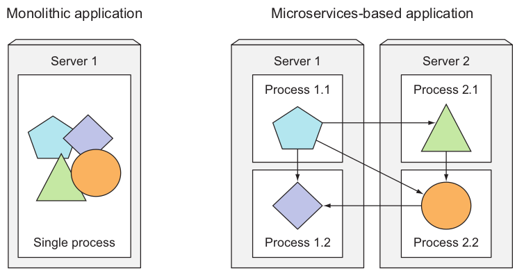
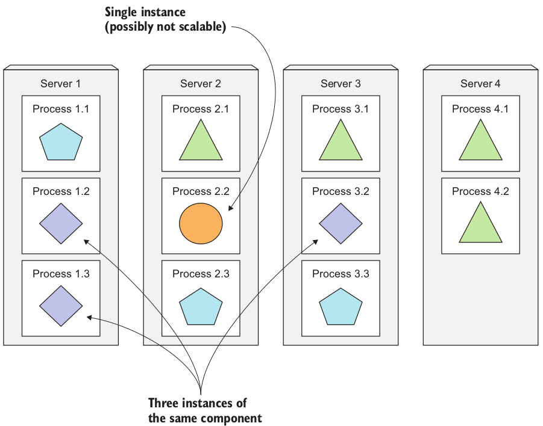
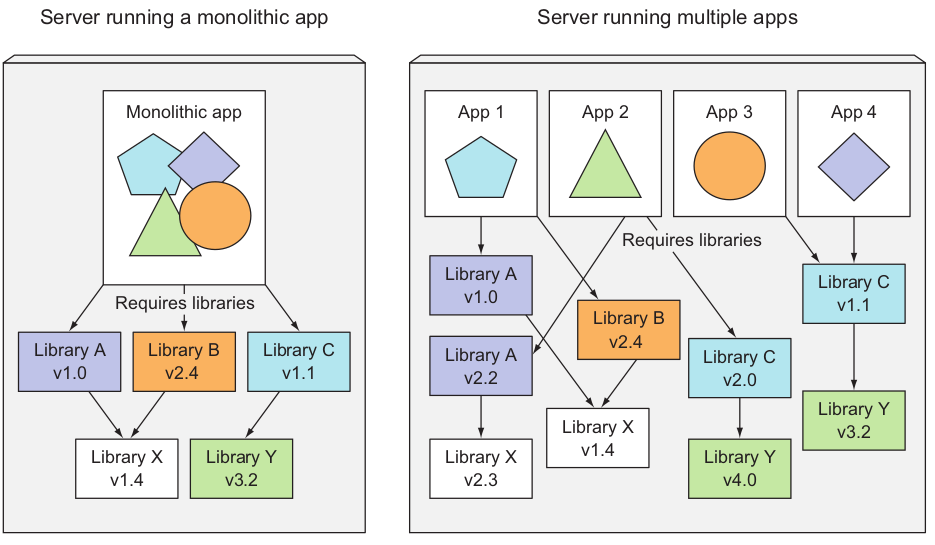
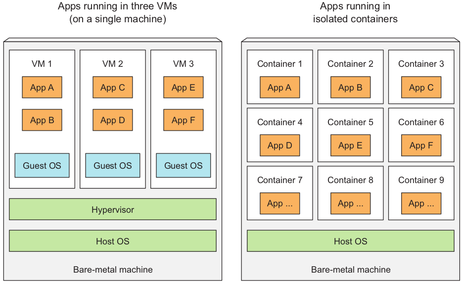
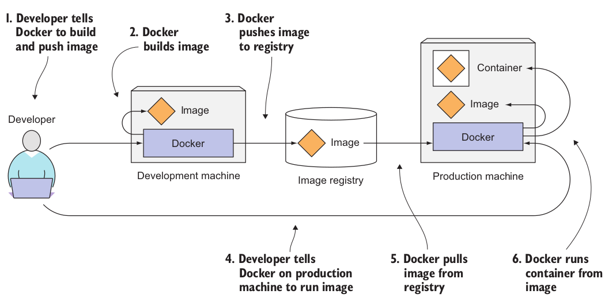
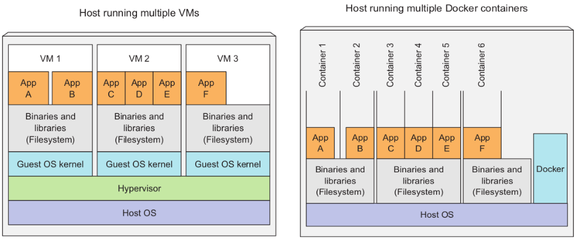
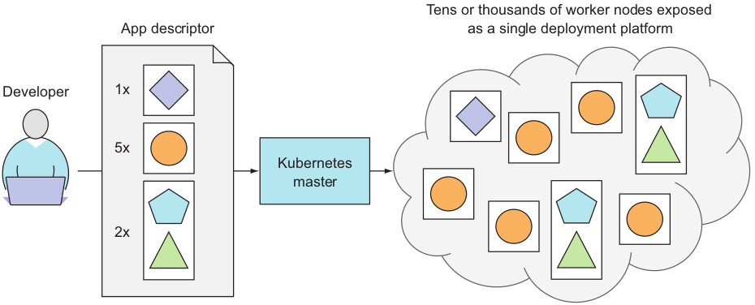
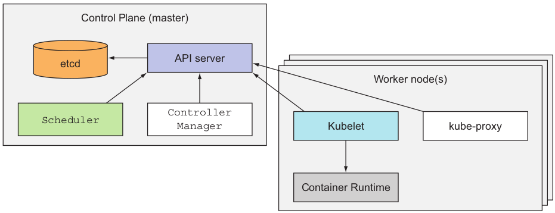
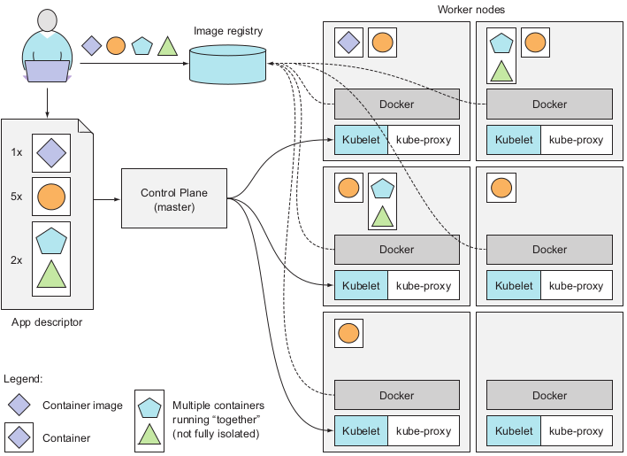

# Introduction

## Monolithic Applications

Monolithic apps are like a big, single unit where all the parts of the software are tightly connected and work together. This setup can make them easier to build and manage at first, but as they grow, they can become hard to update and maintain. 

## Microservices

Microservices are like a set of small, separate services that each do one specific job in a larger system. Each service runs independently but can talk to the others when needed. This setup makes it easier to update and scale each service without disrupting the whole system.

## Moving from monolithic apps to microservices

Monolithic applications are systems where all parts are closely linked and operate as one. Changing any part requires updating the whole system, which can make it complex and lower its quality over time. These apps usually run on a few powerful servers. To handle more work, you can either add more resources to these servers (scaling up), which can get expensive and has limits, or add more servers (scaling out), which might need big changes to the software. However, if one part of the app can't be scaled, then scaling the whole app becomes difficult unless you can break the app into smaller pieces.

- **Splitting apps into microservices**

    To solve complex issues, we're breaking big applications into smaller parts called microservices. Each microservice works on its own and talks to others through clear interfaces. They can communicate in two main ways: synchronous (like using HTTP for RESTful APIs) or asynchronous (like using AMQP).

    These protocols are easy for developers to understand and aren't tied to a specific programming language. Each microservice can be written in whatever language suits it best.

    Since each microservice has its own clear way of communicating with the outside world, we can develop and deploy them separately. Changing one doesn't mean we have to change or redeploy everything else, as long as we don't mess with its communication rules too much.

- **Scaling Microservices**

    Scaling microservices is different from scaling monolithic systems. In monolithic setups, you have to scale the entire system together. But with microservices, you can scale each service individually. This means you can focus on increasing resources for only the services that need them, while keeping others at their original size.

    For example, some parts of the system might be replicated across multiple servers to handle more load, while others stay as single processes. When a monolithic system hits a scalability roadblock because one part can't scale, breaking it into microservices lets you scale the parts that can handle it horizontally (across multiple servers), while vertically (more power) scaling the parts that can't.

    

- **Deploying Microservices**

    While microservices offer advantages, they also come with challenges. Managing a small number of components is easy, but as the number grows, deployment decisions become complex due to increased combinations and inter-dependencies.

    Microservices need to communicate effectively, which requires proper configuration during deployment. As the number of microservices increases, this task becomes tedious and prone to errors, especially when dealing with server failures.

    Additionally, debugging and tracing execution calls in microservices can be challenging since they span multiple processes and machines. However, solutions like distributed tracing systems such as Zipkin are addressing these issues.

- **Understanding the divergence of Environment Requirements**

    In a microservices setup, components are not just deployed independently but also developed that way. Since different teams often handle each component, they might use different libraries, and they can swap them out when needed. This can lead to situations where applications need different versions of the same libraries.

    Deploying applications that rely on different versions of shared libraries, or have other specific environmental needs, can be challenging for operations teams. The more components you have to deploy on the same server, the trickier it becomes to manage all their dependencies and meet their requirements.

    

## Benefits

Getting developers more involved in running applications in production helps them understand user needs and issues, leading to quicker releases based on user feedback. To streamline deployment and avoid delays, developers ideally deploy applications themselves without needing detailed knowledge of the underlying infrastructure.

Developers focus on creating features and improving user experience, while operations teams handle production deployments and infrastructure. In an ideal setup called NoOps, developers deploy applications independently, and operations teams manage the infrastructure without dealing with application specifics.

Kubernetes simplifies this by abstracting hardware and providing a unified platform for deploying and running apps. This allows developers to deploy apps without assistance and lets operations teams focus on infrastructure maintenance without needing deep knowledge of the applications.

## Understanding what containers are

When you have different software pieces on one computer needing different setups or versions, it's a hassle to manage them all separately. You can give each one its own virtual machine, but that's wasteful and time-consuming. As the number of software pieces grows, it becomes impractical to give each its own virtual machine. This wastes both hardware and the time of the people managing the system.

## Isolating Components with Linux Container Technologies

Instead of using virtual machines, developers are using Linux container technology to isolate different software processes. This allows multiple services to run on the same machine while keeping their environments separate and isolated from each other, similar to virtual machines but with less overhead. Each process in a container runs within the host's operating system, just like any other process, but it's still isolated from other processes.

# Comparing Virtual Machines to the Containers

Containers are lighter than virtual machines, so you can run more software on the same hardware. Virtual machines need to run their own system processes, which takes up extra resources, while a container is just one isolated process running in the host operating system. Instead of grouping multiple apps together in one VM due to resource constraints, containers let you have one container for each app, allowing you to fit many more apps on the same machine.

When you have three VMs on a host, each VM runs its own operating system on shared hardware, managed by a hypervisor. But containers all use the same host operating system, so they call the same kernel. This means containers are more lightweight than VMs and start up immediately without needing to boot anything up.

VMs offer full isolation because each runs its own Linux kernel, while containers share the same kernel, which might pose a security risk. But if you have limited hardware and want to run many isolated processes, containers are better because they have lower overhead.

**Note**: Two types of hypervisors exist. Type 1 hypervisors don’t use a host OS, while Type 2 do.

## Mechanism that make container isolation possible

Containers use two main mechanisms to isolate processes: `Linux Namespaces` and `Linux Control Groups` (cgroups).

1. **Linux Namespaces**: These ensure that each process has its own view of the system, including files, processes, network interfaces, and hostnames. Different types of namespaces exist, such as Mount, Process ID, Network, Inter-process communication, UTS, and User ID. Each type of namespace isolates a specific group of resources. For example, the UTS namespace controls the hostname and domain name visible to a process, while the Network namespace determines which network interfaces the process can access. By assigning different namespaces to different processes, it's like they're running on separate machines.

2. **Linux Control Groups (cgroups)**: These limit the amount of system resources a process or group of processes can consume, such as CPU, memory, and network bandwidth. Cgroups prevent processes from using more resources than allocated, ensuring fair resource distribution and preventing one process from hogging resources meant for others. This is similar to resource allocation on separate machines.

## Docker Containers

Container technology became more popular with Docker. Docker made containers easy to move between different machines. It simplified packaging applications with all their dependencies into portable packages. When you run an application with Docker, it sees the same files regardless of the machine it's on. For instance, if you packaged your app with files from Red Hat Enterprise Linux, it will act like it's running on RHEL, even if the actual machine runs a different Linux OS.

Think of it like creating a VM image with an OS, installing the app, and distributing it. Docker does this without VMs but still provides isolation like VMs. It uses Linux container tech for isolation. Docker images are made of layers, which can be shared between images. So, if you already downloaded some layers for one image, you don't need to download them again for another image that uses the same layers.

Docker itself doesn’t provide process isolation. The actual isolation of containers is done at the Linux kernel level using kernel features such as Linux `Namespaces` and `cgroups`. Docker only makes it easy to use those features.

## Docker Concepts

Docker is a tool that packages, shares, and runs applications along with their environment. You can bundle your app with everything it needs, from libraries to the whole operating system files. These packages can be uploaded to a central repository and then downloaded and run on any computer with Docker installed.

In Docker, there are three main parts:
- **Images**: These are packages containing your app and its environment. They include the files your app needs and information on how to run it.
- **Registries**: These are places where Docker images are stored and shared. You can upload your image to a registry and then download it on another computer.
- **Containers**: These are like virtual machines but lighter. They are isolated from the host and other processes, and they can only use allocated resources.

## Building, Distributing, and Running a Docker Image

First, the developer creates an image of their application. They upload this image to a registry, making it accessible to anyone with access to the registry. Others can then download the image to their own machines running Docker. When they run the image, Docker creates a separate container for it, running the specified executable.

## Comparing Virtual Machines and the Docker Containers

Linux containers are similar to virtual machines but lighter. Now, let's see how Docker containers compare to VMs and how Docker images compare to VM images. In the comparison, we'll look at six applications running in both VMs and Docker containers.

Apps A and B have access to the same files whether they're in a VM or separate Docker containers. Each Docker container has its own isolated filesystem, so how can they share files?

Docker images are made of layers. Different images can have the same layers, as every Docker image is built on top of another. This makes image distribution faster because shared layers don't need to be transferred again. Also, layers help reduce image storage space. Each layer is stored only once, so if two containers share the same base layers, they can read the same files. However, changes made by one container don't affect the other because container image layers are read-only. When a container runs, a new writable layer is created on top of the image layers. If a process writes to a file in the underlying layers, a copy is made in the top layer, and the process writes to the copy.

## Portability limitations of Container Images

In theory, you can run a container image on any Linux machine with Docker. But there's a catch. Since all containers on a machine share the same Linux kernel, if an app in a container needs a specific kernel version, it might not work on every machine. If the machine has a different kernel version or lacks certain kernel modules, the app won't run.

Containers are lighter than VMs, but they have limitations. Unlike VMs, containers can't run their own kernel. Also, a containerized app made for a specific hardware type, like x86, won't run on a different hardware type, like ARM. For that, you still need a VM.

## Kubernetes

Kubernetes is a software system that allows you to easily deploy and manage containerized applications on top of it. It enables you to run your software applications on thousands of computer nodes as if all those nodes were a single, enormous computer.

Deploying applications through Kubernetes is always the same, whether your cluster contains only a couple of nodes or thousands of them. The size of the cluster makes no difference at all. Additional cluster nodes simply represent an additional amount of resources available to deployed apps.

## Understanding the core of what kubernetes does

In the simplest view, Kubernetes has a master node and worker nodes. When developers send a list of apps to the master, Kubernetes spreads them out across the worker nodes. It doesn't matter which node an app goes to, as long as it runs. Developers can also tell Kubernetes to keep certain apps together on one node. Apps deployed on different nodes can still communicate with each other the same way.

Its benefits:

- Helping developers focus on the core app feature.
- Helping OPS teams achieve better resource utilization.

## Architecture of Kubernetes Cluster

At the hardware level, a Kubernetes cluster is composed of many nodes, which can be split into two types:
1. **The master node**: It hosts the Control Plane, which manages the entire system.
2. **Worker nodes**: These nodes run the actual applications you deploy.

The **Control Plane (master node)** includes several components:
- **Kubernetes API Server**: It's where you and other Control Plane components communicate.
- **Scheduler**: It assigns worker nodes to your apps.
- **Controller Manager**: It handles cluster-level tasks like replicating components and managing nodes.
- **etcd**: It stores the cluster's configuration.

These Control Plane components control the cluster's state but don't run your apps; that's the job of the worker nodes.

**Worker nodes**

It runs your containerized applications and include:
- **Container runtime (like Docker)**: It runs your containers.
- **Kubelet**: It talks to the API server and manages containers on its node.
- **Kubernetes Service Proxy (kube-proxy)**: It balances network traffic between application components.

## Running an application in Kubernetes

To run an app in Kubernetes, you package it into container images, upload these to a registry, and then send a description of your app to the Kubernetes API server. This description tells Kubernetes which container images make up your app, how they're connected, if they should run together on the same node, and how many copies should be running. It also specifies which components provide services to clients and need to be accessible via a single IP address for other components to find.

- **How the description results in a running container**

    When you describe your app to Kubernetes, it organizes the containers into groups and assigns them to worker nodes based on available resources. Then, the Kubelet on each node tells Docker to fetch the needed container images and run the containers. Each group of containers is called a pod, and you can specify how many copies of each pod should run. Kubernetes takes care of scheduling these pods on worker nodes and managing the containers.

    

- **Keeping the containers running**

    Once your app is up and running, Kubernetes keeps it in line with what you described. For instance, if you said you want five web server instances running, Kubernetes ensures there are always five. If one instance fails, Kubernetes restarts it automatically. If a worker node fails, Kubernetes moves the containers to other nodes and keeps them running as before.

- **Scaling the number of copies**

    While your app is running, you can tell Kubernetes to add or remove copies as needed. You can let Kubernetes decide the best number based on factors like CPU usage, memory, or queries per second.

- **Hitting a moving target**

    Kubernetes might move your containers around for various reasons, like when a node fails or to make space for other containers. But if your container offers a service, how can clients find and connect to it if it keeps moving? 

    To solve this, you can tell Kubernetes which containers offer the same service. Kubernetes then exposes them all at one fixed IP address, known to all apps in the cluster. This is done through environment variables or DNS. The kube-proxy ensures that connections to the service are balanced across all containers offering it. This means clients can always connect to the service, even if its containers move around.

## Benefits of using Kubernetes

Following are the benefits of using kubernetes:

1. **Simplifying Application Deployment**

    Kubernetes simplifies app deployment by treating all worker nodes as a single platform. Developers can deploy apps without worrying about specific server details. Nodes become a pool of resources for apps to use. Sometimes, developers might need specific hardware for an app, like SSDs. With Kubernetes, they can instruct it to choose nodes with SSDs, rather than manually selecting a node. This flexibility is helpful for optimizing app performance.

2. **Achieving better utilization of hardware**

    Setting up Kubernetes and using it to run your apps instead of doing it manually disconnects your app from the infrastructure. When you ask Kubernetes to run your app, it picks the best node based on your app's needs and available resources.

    Using containers and not tying your app to a specific node lets it move freely in the cluster. This flexibility means different parts of your app can be placed together efficiently on nodes, making better use of hardware resources.

    Kubernetes can move apps around the cluster anytime, making better use of the infrastructure than manual methods. Computers are better at finding optimal combinations of app components and server nodes compared to humans, especially with many components and nodes to consider.

3. **Health checking and self healing**

    A system that can move apps around the cluster is useful when servers fail. As your cluster grows, server failures become more common. Kubernetes keeps an eye on your app components and the nodes they're on. If a node fails, Kubernetes moves the app components to other nodes automatically. This saves the ops team from having to move components manually. They can focus on fixing the failed node instead of relocating the app.

3. **Auto Scaling**

    With Kubernetes, the ops team doesn't have to watch each app's load all the time. Kubernetes can monitor resources used by apps and adjust how many instances are running. If Kubernetes is on cloud infrastructure, it can scale the cluster automatically based on app needs, making it easy to add or remove nodes as required.